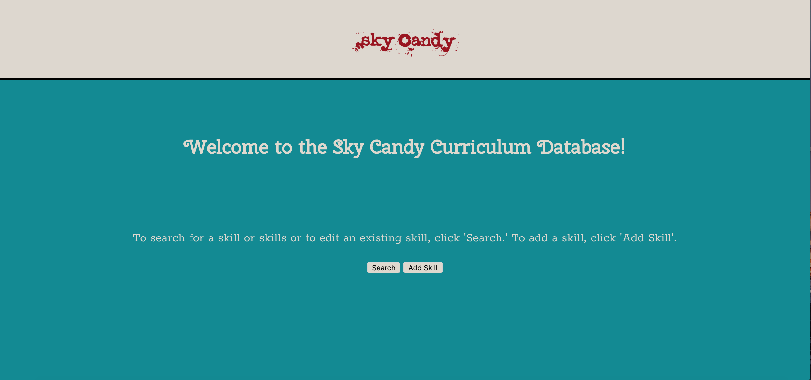
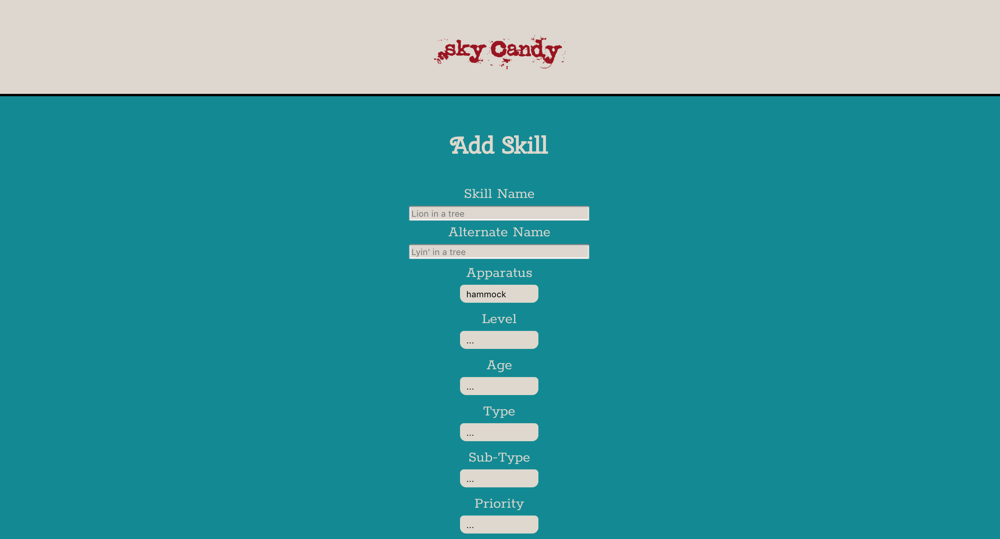

Sky Candy Curriculum Database API
=========================================


Summary
-------
Built for Sky Candy Austin, an aerial studio in Austin, TX, this will hold all of the curriculum for the aerial classes. Sky Candy staff will be able to access, add, delete and update skills. Skills can be searched by a variety of filters including age, level, name, and apparatus.

Eventually, on a larger scope, there will be differentiated log-ins for teachers, admin, and front desk staff with different levels of access. There will also be the ability to update, add, or delete from tables other than just the skills table. 

On the database side, I built services and routers to eventually handle the above additions to the client-side. In other words, the database, including the number of tables, was created with eventual growth in mind.

Screenshots
-----------





Live [Link](https://sky-candy-database.rachaelleeshaw.now.sh)

API Overview
------------
```# /api
.
 	* /action
 		* GET
 			* /
 			* /:id
 		* POST
 			* /
 		* PATCH 
 			* /:id
 		* DELETE
 			* /:id
 	* /age
 		* GET
 			* /
 			* /:id
 		* POST
 			* /
 		* PATCH 
 			* /:id
 		* DELETE
 			* /:id
 	* /apparatus
 		* GET
 			* /
 			* /:id
 		* POST
 			* /
 		* PATCH 
 			* /:id
 		* DELETE
 			* /:id
 	* /class
 		* GET
 			* /
 			* /:id
 		* POST
 			* /
 		* PATCH 
 			* /:id
 		* DELETE
 			* /:id
 	* /level
 		* GET
 			* /
 			* /:id
 		* POST
 			* /
 		* PATCH 
 			* /:id
 		* DELETE
 			* /:id
 	* /priority
 		* GET
 			* /
 			* /:id
 		* POST
 			* /
 		* PATCH 
 			* /:id
 		* DELETE
 			* /:id
 	* /allskills
 	 	* GET
 			* /
 			* /:id
 	* /skill
 		* GET
 			* /
 			* id/:id
 		* POST
 			* /
 		* PATCH 
 			* /:id
 			* /name/:id 
 		* DELETE
 			* /:id
 	* /name
 		* GET
 			* /:id
 		* POST
 			* /
 		* PATCH 
 			* /:id
 		* DELETE
 			* /:id
```
GET `/api/action`
```
//res.body
{
	[
		id : id,
		action : action
	]
}
```

GET `/api/action/:id`
```
//req.body
{
	id : id
}
//res.body
{
	id: id,
	action: action
}
```
POST `/api/action/`
```
//req.body
{
	action : action
}
//res.body
{
	id : id,
	action : action

}
```
DELETE `/api/action/:id`
```
//req.body
{
	id : id
}
//res.body
{
	status : 204
}
```
PATCH `/api/action/:id`
```
//req.body
{
	id : id
}
//res.body
{
	status : 204
}
```

GET `/api/age`
```
//res.body
{
	[
		id : id,
		age : age
	]
}
```

GET `/api/age/:id`
```
//req.body
{
	id : id
}
//res.body
{
	id: id,
	age : age
}
```
POST `/api/age/`
```
//req.body
{
	action : action
}
//res.body
{
	id : id,
	action : action

}
```
DELETE `/api/age/:id`
```
//req.body
{
	id : id
}
//res.body
{
	status : 204
}
```
PATCH `/api/age/:id`
```
//req.body
{
	id : id
}
//res.body
{
	status : 204
}
```

GET `/api/apparatus`
```
//res.body
{
	[
		id : id,
		apparatus : apparatus
	]
}
```

GET `/api/apparatus/:id`
```
//req.body
{
	id : id
}
//res.body
{
	id: id,
	action: action
}
```
POST `/api/apparatus/`
```
//req.body
{
	action : action
}
//res.body
{
	id : id,
	action : action

}
```
DELETE `/api/apparatus/:id`
```
//req.body
{
	id : id
}
//res.body
{
	status : 204
}
```
PATCH `/api/apparatus/:id`
```
//req.body
{
	id : id
}
//res.body
{
	status : 204
}
```

GET `/api/class`
```
//res.body
{
	[
		id : id,
		class : class
	]
}
```

GET `/api/class/:id`
```
//req.body
{
	id : id
}
//res.body
{
	id: id,
	action: action
}
```
POST `/api/class/`
```
//req.body
{
	action : action
}
//res.body
{
	id : id,
	action : action

}
```
DELETE `/api/class/:id`
```
//req.body
{
	id : id
}
//res.body
{
	status : 204
}
```
PATCH `/api/class/:id`
```
//req.body
{
	id : id
}
//res.body
{
	status : 204
}
```

GET `/api/level`
```
//res.body
{
	[
		id : id,
		level : level
	]
}
```

GET `/api/level/:id`
```
//req.body
{
	id : id
}
//res.body
{
	id: id,
	level: level
}
```
POST `/api/level/`
```
//req.body
{
	level : level
}
//res.body
{
	id : id,
	level : level

}
```
DELETE `/api/level/:id`
```
//req.body
{
	id : id
}
//res.body
{
	status : 204
}
```
PATCH `/api/level/:id`
```
//req.body
{
	id : id
}
//res.body
{
	status : 204
}
```


GET `/api/priority`
```
//res.body
{
	[
		id : id,
		priority : priority
	]
}
```

GET `/api/priority/:id`
```
//req.body
{
	id : id
}
//res.body
{
	id: id,
	priorty: priority
}
```
POST `/api/priority/`
```
//req.body
{
	priority : priority
}
//res.body
{
	id : id,
	priority : priority

}
```
DELETE `/api/priority/:id`
```
//req.body
{
	id : id
}
//res.body
{
	status : 204
}
```
PATCH `/api/priority/:id`
```
//req.body
{
	id : id
}
//res.body
{
	status : 204
}
```

GET `/api/skill/id/:id`
```
//req.body
{
	id : id,
}
//res.body
{
	id: id,
	name : name_id,
	apparatus : apparatus_id,
	action : action_id,
	age : age_id,
	class : class_id,
	level : level_id,
	priority : priority_id,
	details : details,
	prerequisites : prerequisites,
	warm_up : warm_up,
	video : video
}
```
POST `/api/skill/`
```
//req.body
{
	name : name_id,
	apparatus : apparatus_id,
	action : action_id,
	age : age_id,
	class : class_id,
	level : level_id,
	priority : priority_id,
	details : details,
	prerequisites : prerequisites,
	warm_up : warm_up,
	video : video
}
//res.body
{
	id : id,
	name : name_id,
	apparatus : apparatus_id,
	action : action_id,
	age : age_id,
	class : class_id,
	level : level_id,
	priority : priority_id,
	details : details,
	prerequisites : prerequisites,
	warm_up : warm_up,
	video : video
}
```
DELETE `/api/skill/id/:id`
```
//req.body
{
	id : id
}
//res.body
{
	status : 204
}
```
PATCH `/api/skill//id/:id`
```
//req.body
{
	id : id
}
//res.body
{
	status : 204
}
```
PATCH `/api/skill/name/:id`
```
//req.body
{
	skill_id : skill_id
}
//res.body
{
	status : 204
}
```

GET `/api/allSkillsRouter`
```
//res.body
{
	[
		id : id,
		name : name,
		apparatus : apparatus,
		action : action,
		age : age,
		class : class,
		level : level,
		priority : priortiy,
		details : details,
		prerequisites : prerequisites,
		warm_up : warm_up,
		alt_names : []
	]
}
```

GET `/api/allSkillsRouter/id/:id`
```
//req.body
{
	id : id
}

//res.body
{
	id : id,
	name : name,
	apparatus : apparatus,
	action : action,
	age : age,
	class : class,
	level : level,
	priority : priortiy,
	details : details,
	prerequisites : prerequisites,
	warm_up : warm_up,
	alt_names : []
}
```


Built with:
-----------
Client-side
* HTML5
* CSS
* JavaScript
* React

Server-side
* Node
* Knex
* Express
* PostgreSQL
* Heroku
* Zeit